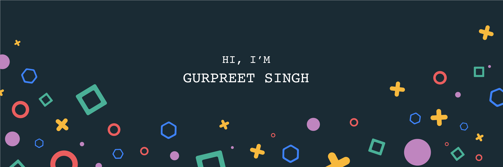

Hey there 👋

I’m Gurpreet, a senior full-stack engineer, creative coder specializes in front-end development. I make it my mission to translate user-focused designs into pixel-perfect websites or applications that run blazing fast.

## 💼 Skills

More Skills

 

 

 

 
